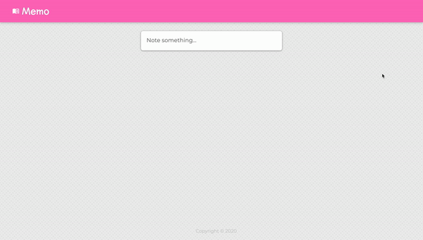
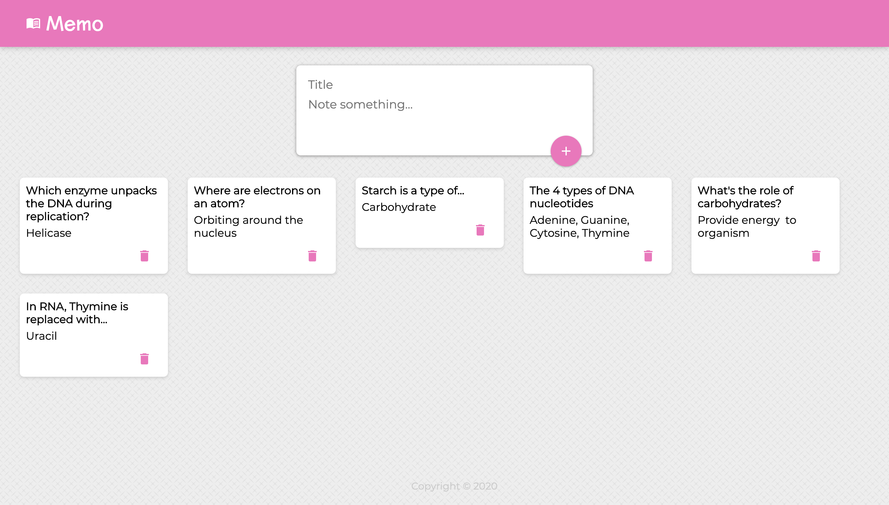

# Memo

Memo is a notekeeper app, like Google Keep, where a user inputs a note and and it displays the notes on the site. This app shows the efficiency of React components.

## Requirements

Make sure to dowload Node.js from https://nodejs.org/en/download/

After cloning the repo, navigate to the project in terminal (cd project-name) and type the following:

```bash
npm start
```

This will start the application on local host

## Usage




